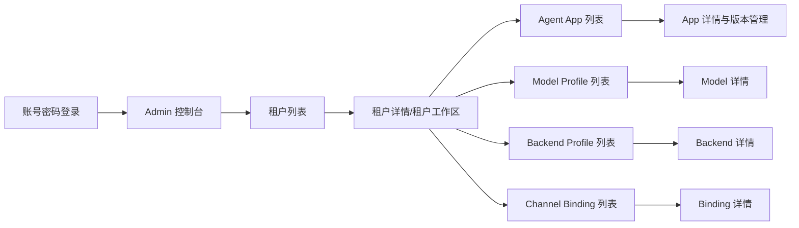
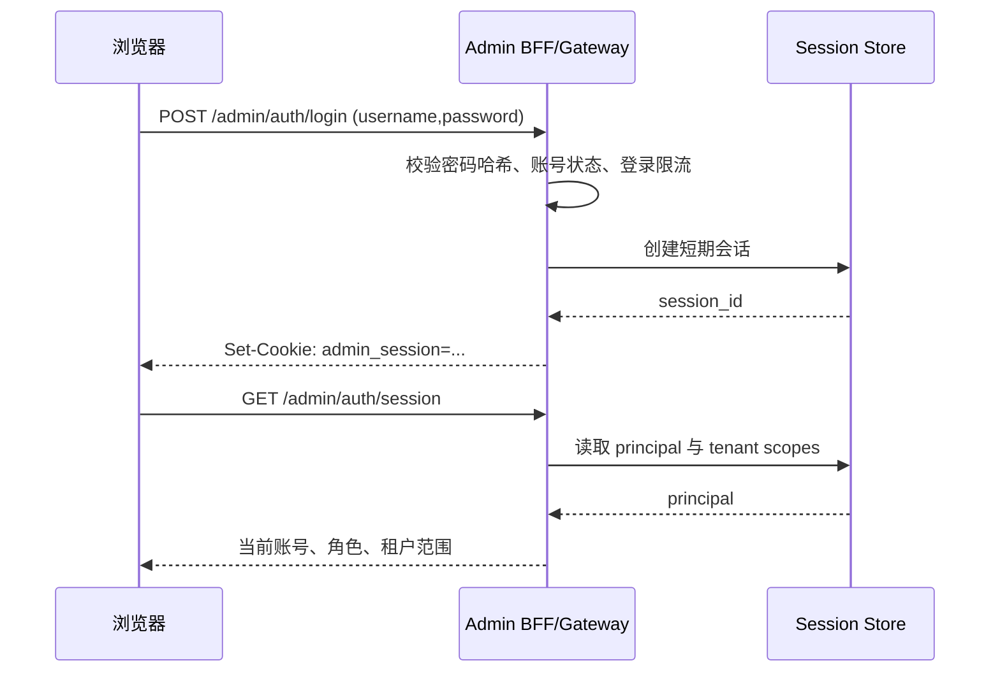

# Admin 控制台产品与技术设计

> 本文是 Admin Web UI 的目标设计。它把当前的“输入资源 ID 的深链接编辑器”重新定义为一个真正的多租户控制面：管理员使用账号密码登录，进入同源 `/admin`，通过租户列表和租户内资源列表完成发现、查看、编辑、发布和审计。

## 0. 设计结论

Admin UI 的核心交互应当是：



目标产品不是让管理员记住 `tenant_id`、`app_id` 或 `profile_id`，而是提供：

- 同源访问：用户打开部署域名后进入 `/admin`，不手动填写 API 地址。
- 账号会话：登录接口负责账号密码校验，浏览器只持有 HttpOnly 会话 Cookie。
- 多租户发现：服务端返回当前账号有权限管理的租户列表。
- 资源列表：租户下的 App、Revision、Model、Backend、Binding 都有列表、搜索、筛选、分页。
- 详情管理：列表每一行都能进入详情页，详情页显示内部信息和可执行操作。
- 可追溯变更：发布、回滚、状态迁移等高影响操作需要 reason、correlation ID 和审计记录。
- 服务端授权：前端只负责呈现，租户范围、资源权限和操作权限始终由服务端决定。

## 1. 产品范围与非目标

### 1.1 首期范围

首期控制台覆盖以下资源：

| 层级 | 资源 | 主要操作 |
| --- | --- | --- |
| 平台 | 管理员会话 | 登录、登出、当前账号、会话失效 |
| 平台 | 租户 | 列表、搜索、创建、查看、编辑、状态迁移 |
| 租户 | Agent App | 列表、创建、元数据编辑、状态迁移、详情 |
| App | Agent Revision | 列表、创建草稿、编辑、发布、回滚、Canary |
| 租户 | Model Profile | 列表、创建、完整配置替换、状态迁移、详情 |
| 租户 | Backend Profile | 列表、创建、能力绑定编辑、状态迁移、详情 |
| 租户 | Channel Binding | 列表、创建、协议配置编辑、状态迁移、详情 |

审计查询、用量成本、系统健康聚合属于后续阶段，但所有写操作从首期开始就必须产生审计上下文。

### 1.2 非目标

- 不在浏览器中保存或展示 `TRPC_ADMIN_TOKEN`、模型密钥、DSN 或渠道凭据。
- 不在没有服务端数据支撑时制作“实时运营大盘”或估算指标。
- 不让前端通过隐藏按钮代替服务端权限控制。
- 不把当前静态 Token 登录页直接包装成最终生产身份系统。

## 2. 用户与权限模型

### 2.1 管理员角色

系统至少区分两类管理员：

| 角色 | 权限 |
| --- | --- |
| 平台管理员 | 管理平台允许范围内的所有租户，可创建首个租户和管理管理员策略 |
| 租户管理员 | 只能管理显式授权的一个或多个租户及其资源 |

权限由服务端返回并执行。前端可以根据权限隐藏入口，但隐藏不是安全边界；任何列表、详情和写入接口都必须再次做 scope 校验。

### 2.2 权限范围

登录会话对应一个 principal：

```json
{
  "subject_id": "user_01J...",
  "role": "tenant_admin",
  "tenant_scopes": ["t_01...", "t_02..."],
  "can_create_tenant": false
}
```

跨租户对象不得通过错误信息、数量、分页或 URL 侧信道泄露。无权详情统一返回 `404 not_found`；无权写入返回 `403 forbidden`。

## 3. 同源部署与登录会话

### 3.1 访问地址

生产环境推荐单域名部署：

```text
https://console.example.com/admin
```

浏览器访问 `/admin`，静态资源和 Admin API 使用同源地址：

```text
/admin/auth/login
/admin/auth/session
/admin/v1/tenants
/admin/v1/tenants/{tenant_id}/apps
```

开发环境可以继续使用 Vite：

```text
http://localhost:5173/admin  -> Vite 静态页面
http://localhost:5173/admin/* -> 代理到 http://127.0.0.1:8080/admin/*
```

前端不再提供“API 地址”输入框。反向代理或 Vite proxy 负责把同源路径转发到 Gateway。

### 3.2 登录流程



会话要求：

- Cookie 使用 `HttpOnly`、`Secure`、`SameSite=Lax/Strict`，生产环境禁止通过 JavaScript 读取。
- 写请求校验 CSRF Token 或同等的 Origin/Referer 策略。
- 登录失败、验证码/锁定策略和会话过期由服务端控制。
- 登出应立即使当前会话失效；修改密码、移除权限和管理员禁用也应能吊销会话。
- 密码只保存 Argon2id 或等价强度的哈希，不进入日志、审计 payload 或前端状态。
- 可在同一会话模型上接入 OIDC/SSO，不改变前端资源权限模型。

当前 `StaticAuthenticator` 仍是服务进程级 Bearer Token 边界，只适合作为迁移期或内部 BFF 的上游凭证，不能作为最终浏览器登录体验。配置 `TRPC_ADMIN_USERNAME` 与 `TRPC_ADMIN_PASSWORD` 后，服务会在保留静态 Bearer 兼容性的同时启用同源账号密码登录；浏览器只接收 `HttpOnly` 会话 Cookie，不需要填写 API 地址或 Token。

## 4. 信息架构与路由

```text
/admin/login
/admin
├── /overview                         # 可选：只放真实聚合数据
├── /tenants                          # 租户列表
├── /tenants/new                      # 创建租户
├── /tenants/:tenantId                # 租户详情与设置
├── /tenants/:tenantId/apps           # App 列表
├── /tenants/:tenantId/apps/new       # 创建 App
├── /tenants/:tenantId/apps/:appId    # App 详情
├── /tenants/:tenantId/apps/:appId/revisions
├── /tenants/:tenantId/models         # Model Profile 列表
├── /tenants/:tenantId/models/:id     # Model 详情
├── /tenants/:tenantId/backends       # Backend Profile 列表
├── /tenants/:tenantId/backends/:id   # Backend 详情
├── /tenants/:tenantId/bindings       # Channel Binding 列表
├── /tenants/:tenantId/bindings/:id   # Binding 详情
├── /audit                            # 后续：跨租户审计（按权限过滤）
└── /account                          # 当前账号、会话、退出登录
```

### 4.1 全局壳层

全局壳层使用 TDesign Layout/Menu/Breadcrumb/Dropdown/Notification 等组件：

- 顶部：产品名称、当前租户、面包屑、系统状态、当前管理员、退出登录。
- 左侧：租户管理与当前租户资源导航；根据 `session` 权限显示可用入口。
- 主区域：页面标题、筛选工具栏、列表或详情内容。
- 移动端：侧栏折叠为图标导航，当前租户和面包屑仍可追溯。

### 4.2 租户列表

这是登录后的默认页，不再要求输入 Tenant ID。

表格列建议：

```text
租户名称 | Tenant Key | 状态 | App 数 | Model 数 | Backend 数 | 更新时间 | 操作
```

支持：

- 关键字搜索：名称、Tenant Key、Tenant ID。
- 状态筛选：active、suspended、disabled。
- 服务端分页和稳定排序。
- “创建租户”按钮，仅在 `can_create_tenant=true` 时出现。
- 行操作：查看详情、进入租户、更多操作。
- 空状态、加载骨架、权限错误、网络错误和分页失败状态。

App/Model/Backend 数量必须来自服务端聚合字段，不能由前端根据当前页猜测。

### 4.3 租户详情与租户工作区

租户详情页既是租户设置页，也是进入租户资源的工作区。顶部显示：

- 租户名称、Tenant Key、Tenant ID、状态标签。
- 创建时间、更新时间、配置版本。
- 当前管理员对该租户的权限范围。
- “进入租户工作区”或面包屑入口。

设置区展示并编辑：

- 限流 RPM、最大并发执行数。
- 月度 Token 预算、金额上限、账单币种。
- 审计保留天数、日志脱敏级别、Trace 采样率。
- 默认 App、默认 Backend。

租户下资源通过 TDesign Tabs 或二级导航进入四个标准列表：Apps、Models、Backends、Bindings。

### 4.4 Agent App 列表与详情

App 列表列：

```text
展示名 | App Key | 状态 | 当前版本 | Canary 版本 | 配置版本 | 更新时间 | 操作
```

App 详情分为四个区域：

1. **基本信息**：App ID、App Key、展示名、描述、所属租户、状态、版本信息。
2. **版本列表**：Revision、状态、Draft Version、创建时间、发布时间、操作。
3. **草稿编辑器**：Instruction、Global Instruction、Model Profile、Generation、Runtime、工具白名单。
4. **发布控制**：发布、回滚、设置/清除 Canary、状态迁移。

已发布 Revision 只读；草稿允许编辑。发布、回滚、Canary 和禁用必须使用二次确认和 reason。

### 4.5 Model / Backend / Binding 列表与详情

这三类资源都遵循同一个页面契约：

```text
列表页（搜索/筛选/分页/新建）
  -> 详情页（内部信息/版本/状态）
  -> 编辑页或页内编辑（完整替换）
  -> 状态操作（审计确认）
```

Model Profile 列表显示 Profile Key、名称、Provider、Model、状态、版本和更新时间；详情显示 endpoint、options、generation 和 `secret_ref` 摘要。不得显示明文密钥。

Backend Profile 列表显示 Profile Key、名称、状态、能力数量和更新时间；详情显示每一条 capability binding 的 provider、endpoint、options、`secret_ref` 摘要。

Channel Binding 列表显示 Binding Key、渠道、目标 App、Provider Account、状态和更新时间；详情显示协议配置、路由 digest、Secret Reference 和版本。不得回显 route key 原文或渠道凭据。

## 5. 列表与详情的通用交互规范

### 5.1 列表状态

每个列表都必须有以下状态：

| 状态 | 呈现 |
| --- | --- |
| 首次加载 | 与表格结构一致的 Skeleton，而不是空白页面 |
| 有数据 | TDesign Table，稳定 row key，支持 hover 和列省略 |
| 无数据 | Empty + 当前筛选条件 + 创建/清除筛选操作 |
| 无权限 | 明确提示当前账号无权限，不暴露对象存在性 |
| 请求失败 | Alert + 重试；保留筛选条件 |
| 写入中 | 按钮 loading，避免重复提交 |

### 5.2 详情状态

详情页必须支持：

- 面包屑返回列表，不依赖浏览器后退。
- 加载骨架和 404/403 统一错误页。
- 版本信息和 `updated_at` 明确显示。
- 配置编辑采用完整替换语义，不能只提交局部字段。
- 409 conflict 时保留本地草稿，重新读取服务端对象，让管理员确认覆盖。
- 503 `audit_unavailable` 时显示“提交状态待确认”，禁止自动重试。

### 5.3 高影响操作

以下操作必须二次确认：

- 发布 Revision。
- 回滚 App。
- 设置或清除 Canary。
- 激活、暂停、恢复、禁用资源。

确认弹窗必须使用 TDesign Dialog，包含：

- 操作对象和目标状态/版本。
- 风险说明。
- 必填 reason。
- 本次 `correlation_id`。
- 确认按钮 loading 和重复点击保护。

## 6. Admin API 合约

### 6.1 会话接口

目标接口：

| 方法 | 路径 | 说明 |
| --- | --- | --- |
| POST | `/admin/auth/login` | 账号密码登录，设置会话 Cookie |
| GET | `/admin/auth/session` | 返回当前管理员、角色、tenant scopes、功能权限 |
| POST | `/admin/auth/logout` | 吊销当前会话 |
| POST | `/admin/auth/refresh` | 可选，轮换短期会话 |

### 6.2 列表接口

所有列表接口统一支持 `cursor`、`limit`、`q`、`status`、`sort`，并返回稳定分页信息：

```json
{
  "request_id": "req_...",
  "data": {
    "items": [],
    "next_cursor": null,
    "total": null
  }
}
```

建议接口：

```text
GET /admin/v1/tenants
GET /admin/v1/tenants/{tenant_id}/apps
GET /admin/v1/tenants/{tenant_id}/apps/{app_id}/revisions
GET /admin/v1/tenants/{tenant_id}/models
GET /admin/v1/tenants/{tenant_id}/backends
GET /admin/v1/tenants/{tenant_id}/bindings
```

列表最少返回 `id`、`key`、`display_name`、`status`、`version`、`updated_at` 和页面所需关联 ID。服务端负责按 principal scope 过滤，不能返回全量数据让浏览器自行筛选。

### 6.3 详情与写入接口

当前已有的详情和写入路由可以继续复用，但应通过 BFF 或 `/admin/v2` 统一响应命名、错误结构和权限上下文：

```text
GET/PATCH /admin/v1/tenants/{tenant_id}
GET/PATCH /admin/v1/tenants/{tenant_id}/apps/{app_id}
POST      /admin/v1/tenants/{tenant_id}/apps/{app_id}/status
POST      /admin/v1/tenants/{tenant_id}/apps/{app_id}/revisions
PATCH     /admin/v1/tenants/{tenant_id}/apps/{app_id}/revisions/{revision}
POST      /admin/v1/tenants/{tenant_id}/apps/{app_id}/revisions/{revision}/publish
POST      /admin/v1/tenants/{tenant_id}/apps/{app_id}/rollback
POST      /admin/v1/tenants/{tenant_id}/apps/{app_id}/canary
GET/PATCH /admin/v1/tenants/{tenant_id}/models/{profile_id}
GET/PATCH /admin/v1/tenants/{tenant_id}/backends/{profile_id}
GET/PATCH /admin/v1/tenants/{tenant_id}/bindings/{binding_id}
```

所有 `PATCH` 都是完整配置替换，必须携带最新版本号。所有需要审计的写操作必须携带 `reason` 和 `correlation_id`。

### 6.4 线协议统一

当前服务返回字段存在 PascalCase 与 snake_case 混用，例如 `TenantID`、`DisplayName` 与 `secret_ref` 并存。长期 Web 合约应统一为一种 DTO 命名（推荐 JSON snake_case 或 lowerCamelCase），并明确：

- 字段缺失、空值和 `null` 的语义。
- 资源列表和详情的最小字段集合。
- 409、403、404、503 的稳定错误类别。
- secret、route key、DSN 的脱敏规则。
- `global_instruction` 等特殊字段的映射测试。

## 7. 前端实现建议

### 7.1 技术结构

继续使用当前 React + React Router + TDesign，不迁移框架：

```text
src/
├── auth/                 # session、login、route guard
├── layout/               # AdminShell、TenantContext、Breadcrumb
├── pages/
│   ├── LoginPage
│   ├── OverviewPage
│   ├── tenants/
│   └── tenant/
├── features/
│   ├── resource-list/    # 通用 Table、筛选、分页、状态
│   ├── resource-detail/  # 详情、版本、编辑、冲突
│   └── audit-action/     # reason、correlation、确认弹窗
├── api/                  # session-aware client、DTO、error mapping
└── styles/               # TDesign token overrides only
```

### 7.2 TDesign 组件约束

优先使用 TDesign 现有组件，不自行复制一套组件样式：

- `Layout`、`Menu`、`Breadcrumb`：全局壳层和导航。
- `Table`、`Pagination`、`Input`、`Select`、`DateRangePicker`：资源列表和筛选。
- `Card`、`Descriptions`、`Form`、`InputNumber`、`Textarea`、`Switch`：详情和编辑。
- `Tag`、`Alert`、`Empty`、`Skeleton`、`Loading`：状态和反馈。
- `Dialog`、`MessagePlugin`、`NotificationPlugin`：高影响操作和异步反馈。

业务 CSS 只能补充布局和响应式规则，颜色、字体、圆角、阴影、间距应尽量引用 TDesign token。

## 8. 从当前 UI 到目标控制台的迁移策略

当前 admin-ui 已经具备 TDesign 组件化的详情编辑能力，但仍是“输入 ID → 打开资源”的模式。迁移分四步：

### 阶段 1：身份与同源壳层

1. 增加 `/admin/login` 和 session API。
2. 将当前 `/connect` 页面替换为账号密码登录，不再要求 API 地址和 Admin Token。
3. 让生产静态资源与 `/admin/*` API 走同源反向代理。
4. 保留当前 Static Admin Token 作为 BFF 到服务端的内部凭证，浏览器不可见。

### 阶段 2：列表 API 与租户工作区

1. 增加 Tenant/App/Model/Backend/Binding/Revision 列表接口。
2. 增加 `/admin/auth/session`，返回租户范围和功能权限。
3. 将 `ResourceLobby` 从“按 ID 打开”改为真实列表；已知 ID 深链接作为兼容入口保留。
4. 增加搜索、筛选、分页、空态、错误态和服务端排序。

### 阶段 3：详情与发布工作流

1. 列表行统一进入详情页。
2. 详情页补充内部信息、关联资源和版本列表。
3. 统一 409 冲突、503 audit unavailable 和本地草稿处理。
4. 将发布、回滚、Canary、禁用等操作统一接入审计确认组件。

### 阶段 4：审计、用量与运营能力

1. 增加按租户、资源、事件类型和时间范围筛选的审计列表。
2. 增加服务端聚合的用量和成本查询。
3. 增加受控健康摘要和配置预检。
4. 记录真实管理员 subject，替代固定的 `admin` actor。

## 9. 验收标准

### 9.1 用户路径

- 管理员打开系统域名后能进入 `/admin/login`。
- 登录成功后直接看到自己有权限的租户列表。
- 管理员无需输入 API 地址、Bearer Token 或资源 ID 即可找到租户和 App。
- 租户、App、Revision、Model、Backend、Binding 均有列表和详情页面。
- 刷新页面不会泄露凭证；退出登录后所有受保护页面失效。

### 9.2 权限与安全

- 不同管理员只能看到服务端授权的租户和资源。
- 通过修改 URL、分页参数或请求体不能越权。
- 浏览器、日志、错误 toast、审计事件中不出现明文密码、Admin Token、模型密钥、DSN 或 route key。
- 写请求具备 CSRF 防护、幂等/重复提交保护和审计上下文。

### 9.3 数据与操作

- 列表分页、搜索、筛选由服务端执行，刷新后状态可恢复。
- 详情显示完整内部信息，但对秘密字段只显示引用或摘要。
- 配置修改遵守 optimistic lock；409 时不覆盖用户草稿。
- 发布、回滚、Canary、禁用等操作都有二次确认、reason、correlation ID。
- `audit_unavailable` 不自动重试，并能引导管理员确认提交结果。

### 9.4 视觉与可用性

- 全局壳层、表格、表单、标签、弹窗和反馈统一使用 TDesign。
- 桌面端和窄屏端都能访问导航、列表操作和详情表单。
- 所有交互控件有 hover、focus、loading、disabled 和错误状态。
- 键盘可完成登录、筛选、列表导航和确认操作。

## 10. 当前实现对照

当前代码已经提供：

- React Router 多页面结构。
- TDesign React 组件与仓库内 TDesign 源码集成。
- Tenant、App、Revision、Model、Backend、Binding 的详情编辑和写入调用。
- optimistic lock、reason、correlation ID、状态迁移和本地草稿处理。

当前仍缺少、也是下一步开发重点的能力：

- 账号密码登录、服务端会话和管理员账号体系。
- 同源生产部署与 BFF 身份边界。
- Tenant 及各类资源的服务端列表接口。
- Revision 列表/读取接口和统一 DTO 命名。
- 审计、用量、Catalog、健康摘要查询接口。

因此，现有 UI 可以作为详情表单和高影响操作组件的基础，但不应继续扩展“最近打开/手动输入 ID”作为主导航模型。

## 11. 代码与接口证据

| 主题 | 位置 |
| --- | --- |
| 当前 Admin 路由、响应封装、错误映射 | `trpcservice/admin/api.go` |
| 当前静态 Admin Bearer 鉴权与租户 scope | `trpcservice/admin/auth.go` |
| Gateway 对 `/admin/v1/*` 的挂载 | `trpcservice/gateway/http.go` |
| 启动配置与 `TRPC_ADMIN_TOKEN` / `TRPC_ADMIN_TENANTS` | `trpcservice/bootstrap/environment.go`、`deploy/example.env` |
| 当前 React 路由与 TDesign 壳层 | `admin-ui/src/App.tsx`、`admin-ui/src/components/AppShell.tsx` |
| 当前 Admin API 客户端 | `admin-ui/src/api/client.ts` |
| 当前详情表单与状态操作 | `admin-ui/src/pages/tenant/`、`admin-ui/src/components/StatusActions.tsx` |
