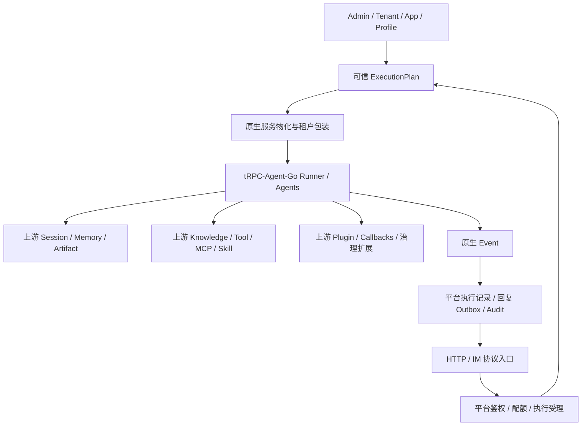

# 上游优先重构：边界、实施顺序与闭环验收

> 状态：二次开发实施方案，允许 breaking change；最终以本文定义的上游优先主路径为准。
> 基线：当前仓库代码及本地依赖 `trpc-agent-go v1.11.2` 源码。实现前须重新核对锁定版本；独立 Go 子模块不能仅凭主模块目录推断可用性。

## 1. 决策与目标

**Agent 能力以 tRPC-Agent-Go 原生接口和实现为中心，平台只补框架不负责的多租户与可靠交付边界。**

本项目直接围绕上游进行二次开发，不保留旧运行时合同、旧 provider、旧配置或旧 API 的兼容层。允许调整并重写内部接口、配置 schema、Admin UI 和数据库表结构。复用必须发生在默认可执行链路中，而不是只增加 import、接口实现或测试 fake。

“充分复用”不等于启用所有 provider、所有协议或删除所有平台代码。每项能力必须有上游实现入口、实际装配、权限边界、闭环证据；无法复用的部分必须记录具体源码限制、保留职责及测试，不能仅以迁移困难为理由。

### 对前序方案的修正

- `CapabilitySet` 有 Memory/Knowledge/Artifact accessor，不代表 Runner 已使用这些能力。当前 `agent/runner_builder.go` 的 Runner 构造只注入 Session，不能宣称已经有完整长期记忆/RAG/Artifact 执行闭环。
- 上游 `AddMemory` 不返回平台任意指定的 MemoryID；不能调用后伪造 ID、Version、时间戳或持久化成功语义。
- 上游 Artifact 以 app/user/session/filename/version 寻址，版本从 0 开始；不能用 SessionID 冒充 UserID，也不能把旧表版本计数当成历史版本集合。
- 上游 Knowledge 接收文本查询与上下文；不能用空 Query 适配平台 vector-only 查询。
- 稳定数据 namespace 不含 Revision。发布版本改变缓存身份，不应意外切断历史记忆与文件。
- metadata filter 或 key prefix 单独都不是授权；包装器必须封闭所有读写、枚举、批量删除和自动工具旁路。
- 文档中的 `event/state -> memory -> reply -> summary/index` 是设计意图，不能当作当前所有 provider 已实现的跨服务事务。
- PostgreSQL/Redis/InMemory 中的平台消息、附件、审计消费者必须先拆分，再删除重复的 Agent Runtime 实现；当前已完成该拆分并删除旧 S3/ObjectStore 主路径。

## 2. 现状与证据

| 位置 | 已核对事实 | 重构结论 |
| --- | --- | --- |
| `trpcservice/agent/factory.go` | 使用 `llmagent.New`、`chainagent.New`；默认仅 llm/chain | 扩展上游编排工厂，不自研执行器 |
| `trpcservice/agent/runner_builder.go` | `NewRunner` 仅配置 `WithSessionService` | 原生注入 Memory/Artifact，LLMAgent 注入 Knowledge |
| `trpcservice/runtime/storage/factory/runtime_factory.go` | Session 是上游接口，其余主要是自研接口；Knowledge 强制同时实现 VectorStore，Artifact 强制同时实现 ObjectStore | 移除错误的能力捆绑，改用原生服务和显式生命周期 |
| `trpcservice/runtime/storage/capabilities.go` | 自研记录、CRUD、向量与对象接口 | 不再作为 Agent 能力的主合同 |
| `trpcservice/bootstrap/environment_providers.go` | 按租户装配上游 Session/Memory/Artifact/Knowledge 服务，以及平台审计和投递存储 | 默认运行链必须使用这些服务，不能只在测试中替换 |
| `trpcservice/skill/skill.go` | 只有 package 声明与说明 | 不计为 Skill 实现 |
| `trpcservice/gateway/dispatch_durable.go` | durable claim 针对 Channel principal；平台保有 message/outbox 状态 | 新协议不可绕过可信主体、执行和可靠交付边界 |

已核对的上游入口：`runner.WithMemoryService`、`runner.WithArtifactService`、`runner.WithPlugins`、`llmagent.WithKnowledge`（自动注入搜索工具）；`server/openai.WithRunner` 与 `Server.Handler()`。Memory 服务含工具及自动提取任务；Artifact 支持指定历史版本读取；Knowledge 有 source/chunking/embedder/vectorstore/retriever 等配套模块。

OpenClaw 在当前主模块目录中未找到对应目录：须核对上游仓库、独立模块、公开接口和版本再做接入决策。不能以没有主模块 import 断言上游不存在，也不能预先承诺某个 Channel 可直接替换。

## 3. 目标架构与包边界



建议保留 `runtime/storage` 管理平台可靠性事实；新增 `runtime/services` 承载原生服务物化。上游相关业务组装仍在 `agent`，不要同时保留两套 Runtime/Runner factory。

| 影响级别 | 包或目录 | 边界 |
| --- | --- | --- |
| 高 | `agent`、`agent/runnerfactory`、`runtime/storage/factory`、新增 `runtime/services`、`bootstrap` | 原生接口、装配、缓存与关闭所有权 |
| 高 | `runtime/storage/{inmemory,postgres,redis}` | 仅保留平台 Session/Message/Reply/Summary/Audit/Attachment 职责；Agent Memory/Knowledge/Artifact 已改用上游合同 |
| 高 | `app`、`backend`、`tool`、`skill` | 编排配置、provider schema、自动工具授权 |
| 条件性高 | `gateway`、`channels` | 上游 server/OpenClaw 接入后协议层替换，安全和投递语义不能丢失 |
| 中 | `runtime/plan*`、`runtime/runner`、`runtime/execution`、`runtime/model` | 新配置摘要、服务租约、事件与取消适配 |
| 中 | `admin`、控制面 repositories、`admin-ui`、`migrations` | schema/配置升级贯穿 UI、校验、序列化和数据库约束 |
| 中 | `observability`、`metrics`、`log`、`model` | 复用上游模型/遥测，避免重复 span 和绕过密钥管理 |
| 保留职责 | `tenant`、`audit`、`runtime/budget`、`runtime/queue`、`outbox` | 框架不能替代平台授权、账本和投递事实；集成点与测试仍可能改 |
| 保留职责 | `attachment`、附件存储、`workspace` | IM 媒体安全和沙箱权限不是 Agent Artifact 的同义词 |
| 低 | `cmd/trpc-healthcheck`、`version.go` | 健康协议不变时通常无需改 |

“保留职责”不等于保证零文件改动。部署、CI、文档、演示配置均为本次完整交付的一部分。

## 4. 原生服务合同

目标服务集合直接持有 `session.Service`、`memory.Service`、`artifact.Service`、`knowledge.Knowledge`，并独立持有资源释放函数。Knowledge 接口本身没有 Close，不能据此忽略其底层向量库/加载任务的关闭。

- Backend Profile 保存 provider 选择、无密钥配置及 SecretRef；控制面不保存 client/service。
- ExecutionPlan 固定 Tenant/App/Revision、工具策略、Knowledge 资源引用、embedding 模型及配置摘要。
- Runtime Factory 使用可信执行作用域构造租户服务。现有 `StorageFactoryInput` 的实际字段须核对，不假定它已有 AppID；缺少的 app/知识库授权作用域通过新的显式构造输入提供。
- 未配置能力可以禁用；已配置却无法构造必须 readiness/发布校验失败，不静默回退到 InMemory。
- InMemory 只作开发和确定性验收，不能替代原有持久化能力后仍宣称生产多节点可用。
- 服务缓存和 Runner 缓存分开：Runner 重建不能清空长期记忆。服务共享以稳定数据范围为键，配置版本用于实例失效；持久数据 namespace 与配置版本分离。
- 使用显式 lease/owner。Runner 借用服务，包装器 Close 不关闭其他 Runner 正在使用的共享 client；持有者在最后租约释放后关闭。须核对上游 Runner.Close 对 Session 等资源的实际行为，避免双重关闭和后台提取任务泄漏。

### Session / Summary

Session 目前只是复用了接口，持久化仍有平台实现。评估并优先使用上游共享 Session provider 与 `session/summary`，平台只包租户身份、授权和必要观测。

平台 message_event、执行租约、Reply Outbox 与 Runner 对话历史是不同事实，保留独立表，不强行让上游 Session 承担它们。同 session 并发控制应放在共享执行协调层，并检查历史追加、摘要覆盖及租约过期语义；不能仅凭上游有 Redis/SQL provider 就宣称有会话串行化。

### Memory

直接注入 `runner.WithMemoryService`，使用上游 memory tools、Reader 和自动提取能力，不再实现另一套 CRUD/索引业务。

包装器绑定可信 tenant/app，校验 AppName 及可信 user/session 后做稳定无歧义编码；读、写、清空、自动任务与 Tools 路径都必须经过同一边界。不得直接返回闭包绑定裸后端的工具从而绕过包装器。跨 Binding 记忆是否共享必须显式配置，默认沿用隔离身份。

自动提取属于独立写权限，不能只过滤 memory_add 就假定禁写；提取所用模型计入预算和 trace。异步入队不等同于 durable commit。选择生产 provider 时必须验证入队持久性、重启丢失窗口、可见性和失败报告。

### Artifact

直接注入 `runner.WithArtifactService`。保留上游完整 app/user/session/filename/version 语义及全部版本读写，不用旧 ArtifactID 强行模拟。

IM attachment 继续负责来源验签、下载大小限制、媒体校验与投递授权。如果业务需要把 Agent Artifact 发到 IM，通过显式受权导出步骤产生附件引用，验证归属、MIME、大小和版本；不直接暴露私有对象 URL。

### Knowledge

使用上游知识加载、切块、embedding、vectorstore、retrieval/rerank 与 `knowledge.Knowledge`，通过 `llmagent.WithKnowledge` 或上游搜索工具接入，二者不重复注册。

发布配置必须包含知识库引用和访问范围、数据版本策略、embedding profile（模型、维度）及检索策略，而非只配置存储地址。导入任务复用上游 pipeline；平台负责上传鉴权、导入任务状态与发布/重建控制。

默认优先使用租户/知识库独立 collection 或等效强隔离能力。使用共享 collection 时，授权条件必须与用户过滤条件作不可移除的 AND；包装所有按 ID 操作、批量操作与导入写入，并验证 provider 真正执行过滤。仅在 SearchRequest.Metadata 填 tenant_id 不足以验收。

## 5. 其余能力的复用决策

| 能力 | 目标与完成标准 |
| --- | --- |
| LLM/Chain/Graph/Parallel/Cycle | 复用具体上游 Agent；平台只保存声明式配置并校验。Graph 必须有节点、边、路由/终止条件与执行测试，不能仅加 kind；并行与循环须验证共享状态、取消和预算 |
| Model | 普通模型路径优先上游 provider；自研 Responses 等实现先对照上游协议能力，只有明确缺口才保留 |
| MCP | 上游 MCP Tool/client；平台管理端点授权、SSRF 防护、凭据、工具发现与白名单、连接生命周期及危险调用审批 |
| Skill | 上游加载/执行能力；平台管理可信工作目录、发布版本、工具授权与沙箱。不把 package 占位或读到 SKILL.md 算作执行闭环 |
| Plugin/Guardrail/Callbacks | 复用上游扩展生命周期挂载平台策略；预算账本与审批事实仍在平台。自动注入工具、子 Agent、MCP 和 Skill 均不可绕过执行期授权 |
| OpenTelemetry | 复用框架原生 span 和官方 OTel SDK；平台补 IM、队列、审计关联，避免 callbacks 与原生链路重复记录或导出敏感内容 |
| server/* | 优先使用上游 Handler 与 Runner 注入点实现所需协议，不再自研同一协议。平台认证先于请求执行，桥接 Runner 只能消费可信 Plan；不能让客户端 RunOptions 覆盖身份/资源/策略 |
| OpenClaw | 先核对独立模块和公开扩展点，验证入站可外部调度、出站可交由 Outbox、账号可多租户绑定。满足后复用网关/通道机制，企业微信私有协议差异保留薄扩展；不复制 OpenClaw 再命名为 bridge |

server/OpenClaw 探针必须跑真实上游 handler/channel 到平台执行边界的测试。仅复用请求结构体不算协议实现复用；若公开入口会绕过平台安全或自动重复发送，先解决该限制再切默认路径。禁止使用上游 internal 包或修改 module cache 作为实现。

## 6. 一致性、安全与发布

不承诺 Session、Memory、向量库、Artifact、Outbox 的跨后端原子提交。区分：执行受理持久化、Runner 事件、工具外部副作用、回复可投递事实。对不确定结果记录待协调状态，不能靠重新执行所有工具恢复，也不能声称外部 exactly-once。

允许直接重写 schema、配置和 API。旧数据不承担兼容义务；当旧模型与上游语义冲突时，删除旧表和旧接口，使用新的最终 schema 重新初始化环境。旧配置、旧 provider 和旧测试 fixture 同样删除，不做双轨运行或隐式转换。

发布前必须验证默认装配只有一条主路径；租户授权先于工具和自动注入能力；上游服务按租户隔离且生命周期明确；平台审计、预算、队列和 Outbox 仍保持可靠性不变量。

## 7. 实施顺序与退出条件

| 阶段 | 工作 | 退出门禁 |
| --- | --- | --- |
| P0 源码与基线 | 固定上游版本/子模块；核对 API、关闭语义、server/OpenClaw 扩展点；记录原有 HTTP/IM/持久化基线 | 每项复用有具体入口和可运行探针；未知能力不进入已完成矩阵 |
| P1 原生服务纵向链路 | 改工厂、原生服务集合、租户包装、Runner/LLMAgent 注入、工具策略、bootstrap/Admin 配置 | HTTP 触发真实上游 Memory/RAG/Artifact 行为；双租户反例测试通过 |
| P2 生产后端与状态 | 接入所选上游持久化 provider；Session/Summary/索引/关闭与迁移验证 | 两个 Worker、重启、并发写、恢复和数据迁移可验证；InMemory 不能作为替代证据 |
| P3 编排与治理 | Graph/Parallel/Cycle、MCP/Skill、Plugin/Guardrail、模型/遥测收敛 | 实际执行而非构造测试；禁止工具、自动提取、超时及副作用失败有反例 |
| P4 协议接入 | 已验证的 server/OpenClaw 接口切主路径，移除重复协议实现 | HTTP/SSE、企业微信、Telegram、媒体、Outbox 回归；协议差异明确列出 |
| P5 清理与发布 | 删除旧接口/实现/测试 fixture；同步配置、UI、迁移说明、部署和文档 | 默认装配只有一条主路径，无无人维护的 legacy/provider 占位 |

每个阶段都必须形成可运行纵向切片。最终只保留一条主路径，不保留 `Memory()` 与 `UpstreamMemory()` 两套 API，也不保留过渡适配器或无人维护的 provider 占位。若上游能力存在限制，记录公开 API、平台边界和验收证据，不能用 fake 或自研同名接口掩盖缺口。

## 8. 闭环验收与 repo clean

### 功能证据

- 从空库经初始化/Admin UI或API配置、发布到 HTTP/SSE 对话；测试模型可确定性地产生工具调用，但 Memory/Artifact/Knowledge 必须使用真实上游实现。
- Memory：一次对话写入，后续对话检索；授权关闭时写工具及自动提取均被拒绝；生产 profile 重启后仍可读。
- Artifact：工具保存两个不同版本并读取各版本；经授权导出到 IM；伪造用户/会话/文件引用失败。
- Knowledge：真实 source -> chunk -> embed -> index -> 上游搜索工具 -> 模型回复；不同租户、知识库和恶意过滤条件无越权。
- 编排/MCP/Skill：真实调用路径、取消、并行状态和循环终止；测试端点可本地提供，不用注册成功代替运行。
- IM：企业微信与 Telegram 的验签/身份、重复消息、异步回复、媒体和投递恢复；凭据可用时运行 live E2E，否则明确报告未验证。
- 两节点/重启、过期 lease、旧 worker 写入、模型/工具超时、上游后台任务关闭；测试不能依赖 sticky session。
- trace 串起 callback/协议入口、Runner、工具、服务读写、Outbox 回复；验证 secret/正文不泄漏。

### 工程门禁

```bash
go test ./... -count=1
go test -race ./... -count=1
go vet ./...
go build ./...
python -m mkdocs build --strict -f docs/mkdocs.yml
./scripts/quickstart.sh --demo
git diff --check
```

另外执行 `admin-ui/package.json` 定义的构建/检查、CI 部署与显式启用的数据库/IM集成测试。记录哪些测试实际执行、哪些因缺少服务或凭据跳过；全包 go test 通过不代表 live E2E 或持久化验证通过。

### Clean 的定义

1. 无重复主路径、废弃导出接口、无引用 provider、临时 fixture 或误导性能力声明；通过调用链和依赖检查确认，而非仅 grep TODO。
2. 删除已被替代的测试，保留并迁移业务不变量测试；不靠删测试降低验收要求。
3. Go 依赖经 tidy/review，生成物不误入库；UI、OpenAPI/配置样例（若有）、部署和文档一致。
4. `git diff --check` 通过，`git status --short` 只出现预期交付文件。字面意义的空 working tree 需要提交；不为了 clean 擅自 commit、reset、clean 或删除用户文件。

本设计文档落地不等于重构完成。最终报告须给出逐能力“上游入口 → 默认装配 → 运行证据 → 删除的旧路径 → 剩余限制”矩阵。

## 9. 实现前待澄清点

以下问题不阻塞设计方向，但必须在 P0 或首个实现 PR 中给出代码级结论：

1. **Runner appName 与租户 namespace 对齐**：当前 Runner 使用 `agentInput.AppID` 作为 app name。若上游 Session、Memory、Artifact 都以 appName 参与寻址，必须统一决定是由 Runner appName 直接使用租户化稳定值，还是由各服务包装器重写 appName。不能出现 Session 使用 `app_id`、Memory 使用 `tenant_id:app_id`、Artifact 又使用另一套 key 的分裂。
2. **自动工具授权粒度**：`llmagent.WithKnowledge` 会自动注入搜索工具，`memory.Service.Tools()` 也可能暴露多个读写工具。实现时必须验证上游是否支持按工具选择注入；若不支持，平台只能在能力级别启停或包装工具集合，不能声称已有单工具粒度治理。
3. **Knowledge 管理面与运行时检索的边界**：`knowledge.Knowledge` 主要服务搜索；上传、导入、重建、删除、版本发布可能需要复用上游 source/chunking/vectorstore 组合，而不是只暴露 `Knowledge.Search`。管理面 API、任务状态和迁移脚本要单独设计。
4. **server/OpenClaw 多租户调度能力**：上游 server 若只绑定单个 Runner，平台必须使用动态 Runner/handler 包装或保留可信 Gateway；OpenClaw 若自带回包路径，必须证明可交给平台 Outbox 管理，否则不能切主路径。
5. **关闭与后台任务所有权**：上游 Runner.Close、Memory 自动提取 worker、Knowledge 加载/索引 worker、Artifact client 的关闭顺序必须以测试固定。共享服务不得被单个 Runner 提前关闭。

## 10. 关联文档

- [原始任务书](project-brief.md)
- [当前架构](architecture.md)
- [包边界](package-boundaries.md)
- [Backend Profile](backend-profile.md)
- [运行时存储](runtime-storage.md)
- [可靠投递](issue-50-reliable-delivery.md)

这些页面描述现状或历史阶段；实施时按阶段更新，不在代码尚未切换前把目标架构写成已实现事实。
